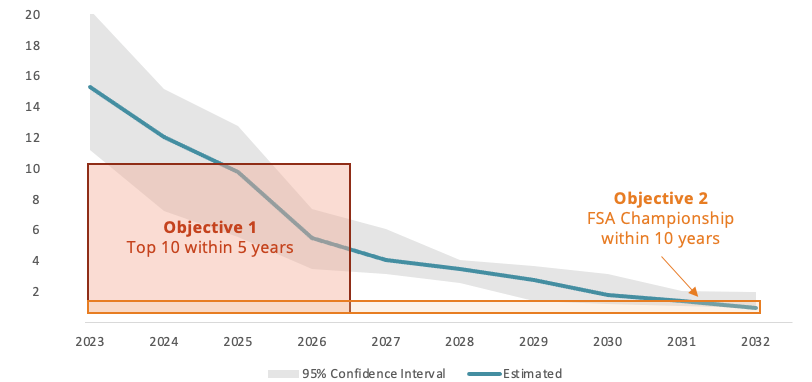
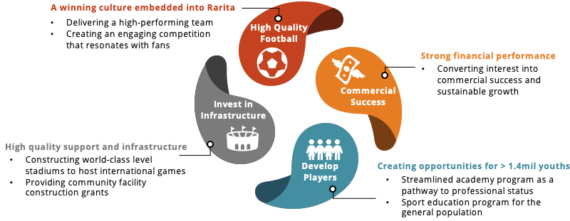
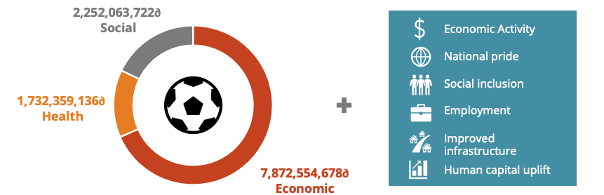
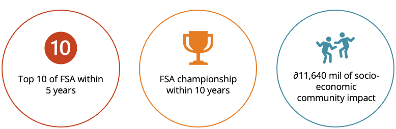

<!-- PROJECT LOGO -->

  <h1 align="center">ACTL4001 Case Report</h1>

  <h3 align="center">Control-Cycle</h3>

<!-- TABLE OF CONTENTS -->

  
Table of Contents

  <ol>
    <li>
      <a href="#about-the-project">About the Project</a>
    </li>
    <li>
      <a href="#project-summary">Project Summary</a>
      <ol>
        <li><a href="#rarita-football-team-selection"> Team Selection</a></li>
        <li><a href="#economic-impact">Economic Impact</a></li>
      </ol>
    </li>
    <li>
      <a href="#project-methodology">Methodology</a>
      <ol>
        <li><a href="#soccer-power-index">Soccer Power Index</a></li>
        <li><a href="#position-specific-variables">Variables</a></li>
        <li><a href="#markdown-reports">Model Analysis</a></li>
      </ol>
    </li>
    <li>
      <a href="#conclusion">Conclusion</a>
    </li>
  </ol>

  <strong>Team Members:</strong>

  <ul style = "font-size:11pt">
  <li>Andrew Uen</li>
  <li>Alastair Nicholls</li>
  <li>Danny Lim</li>
  <li>Kai Zhi Lim</li>
  <li>Kelly Chu</li>
  </ul>

## About the Project

Football is a sport loved and played by billions worldwide. Beyond this, football can provide countries with opportunities for economic gain, global visibility and improved social outcomes. 

In recognizing this, the country of Rarita has engaged our team to develop a strategy for entering the international Football and Sporting Association (“FSA”) League and develop a Rarita Football brand. 

This GitHub repository documents the code and methodology use in completing the [Society of Actuaries Research Institute 2022 Research Challenge](https://www.soa.org/research/opportunities/2022-student-research-case-study-challenge/).
>For an in-depth exploration of our methodology, assumptions and strategy, please refer to the [Control Cycle - Rarita FSA League Report](Control%20Cycle%20-%20Rarita%20FSA%20League%20Report%202022.pdf).

<h1 align="center" id = "project-summary">Project Summary</h1>

### Rarita Football Team Selection

The project began with the process of team selection which involves identifying key selection criteria and then applying it through a predictive model to select the most competitive team. Through the selection of a high performing team, Rarita has strong chances of placing within the top 10 and achieving the FSA championship within 10 years. 

<!-- PROJECT LOGO -->
<figure align="center">
  
  <figcaption align = "center" style = "font-size:9pt;"><b>[Figure 2: Projected Team Ranking – 95% Confidence Interval]</b></figcaption>
</figure>

### Economic Impact

With such achievements, the resulting commercial success creates a cycle of strategic growth by generating sufficient resources to allow implementation of key strategies which support the development of players to their maximum potential whilst engaging the broader community. 
<!-- Fig 5: Cycle of Strategic Growth -->
<figure align="center">
  
  <figcaption align = "center" style = "font-size:9pt;"><b>[Figure 5: Cycle of Strategic Growth]</b></figcaption>
</figure>

Through our two expenditure programs, investments are aimed at the grassroots level, allowing an equitable re-distribution of profits to improve the general quality of life and wellbeing. Ultimately, our strategies will guarantee sustainable and profitable growth, creating on average over **∂11.64 billion** worth of annual socio-economic benefits. 

<!-- Average Annual Socio-Economic Impact -->
<figure align="center">
  
  <figcaption align = "center" style = "font-size:9pt;"><b>[Figure 8: Average Annual Socio-Economic Impact]</b></figcaption>
</figure>

For exploration of financial modelling and underlying assumptions, please refer to the [Excel Model](financial%20projections.xlsx).

## Project Methodology

To create a robust model to select the players of the Rarita Football Team, data from the [English Premier League (EPL)](https://projects.fivethirtyeight.com/soccer-predictions/premier-league/) was used as the training data. The EPL data was split according to the player's roles, namely the Forwards, Midfielders, Defenders and Goalkeepers. A series of models, including [XGBoost](https://xgboost.readthedocs.io/en/stable/) and Regularised Linear Regression were trained on the EPL dataset.

The [tournament dataset](Data\case%20data\Tournament) was then used as the testing data, and the model with the lowest prediction error was selected as the ideal model for each player position.
### Soccer Power Index

ESPN's Soccer Power Index (SPI) is an international and club rating system and is designed to provide the best possible objective rating of a team's current overall skill level. The use of a team's SPI aims to predict which teams will have the most success going forward (Silver, 2009). Though it may not accurately predict goal scorings and results on a match-level, it accounts for a series of different factors that can affect the outcome of the team's performance in the league as a whole, including:
-  Importance of match (e.g., final game of a tournament)
-  Time effect such that the most recently played matches are given a more significant weighting
-  Home-field advantage

### Position Specific Variables

To evaluate which variables had the largest impact on the SPI of each position, the variable importance plot are shown for each position, below:​

#### Forward

 

#### Midfielders

 

#### Defenders

 

In general, the largest indicator of SPI were the player passing rates. For Midfielders and Defenders, short and medium passes completed respectively were key indicators of SPI. Looking at the non-passing completed variables, Midfielders prioritized passes completed to the 18-yard box while Defenders prioritized total distance passed and blocked passes. ​

However, for Fowards no one clear variable stood out. The variable importance declined more gradually, with goals, assists, pressures and shots on target being key variables along with the normal passing ones. Intuitively, this is because each team would have a primary striker that is supported by the other forwards.

### Model Analysis

To further understand the methodology used, explore the R Markdown documents below:

* [Data Cleaning](R%20Markdowns\01%20Data%20Cleaning\Data%20Cleaning%20Analysis.nb.html)
* [Model Analysis](R%20Markdowns\02%20Model%20Analysis\02%20Model%20Analysis.nb.html)

## Conclusion

Ultimately, through our team selection and implementation strategies, we expect Rarita to achieve the below three objectives and successfully develop a Rarita Football brand over the next ten years.

<!--Key Objectives for the Rarita Football Team-->
<figure align="center">
  
  <figcaption align = "center" style = "font-size:9pt;"><b>Figure 1: Key Objectives for the Rarita Football Team</b></figcaption>
</figure>